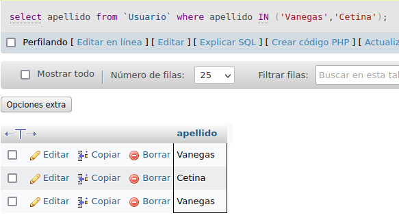

# consultas1.SQL

# EJERCICIOS CONSULTAS SQL

## Tabla de usuario

1. Para visualizar toda la informacion que contiene la tabla `usuario` se puede incluir con la instruccion SELECT el caracter'*' o cada uno de los campos 

SELECT * FROM `Usuario` 

2. Visualizar solamente la identificacion del usuario 

SELECT `identificacion` FROM `Usuario` 

3. Se desea obtener los registros cuya identificacion sean mayorres o iguales a 150, se debe utilizar la clausula WHere que especifica las condiciones que debe reunir los registros que se van a seleccionar 

SELECT * FROM `Usuario` WHERE identificacion>=`150`

4. Si se desea obtener los rgistros cuyo sus apellidos sean Vanegas o Cetina, se debe utilizar el operador IN que especifica los registros que se quieren visualizar en la tabla

`select apellidos from Usuario where apellidos IN('Vanegas', 'Cetina')`

O se puede utilizar el operador OR

`select apellido from Usuario where apellido='Vanegas' or apellido='Cetina'`

5. SI se desea obtener los registros cuya identificacion sea menor de `110` y la ciudad sea CAli se debe utilizar el operador AND.

`SELECT * FROM usuario  WHERE Identificacion<`150` AND ciudad=`Cali`

6. Si se desa obtener los registros cuyos nombres empiecen por la letra a, sebe utilizar l operador LIKE que utiliza los patrones "%" (todos) y '_' (caracter)

`select * from Usuario where nombre LIKE 'A%'`

7. Se desea obtener los registros cuyos nombres tengan la letra a 

`select * from Usuario where nombre LIKE '%a%'`

8. Si se desea obtener los regisro donde la cuarta letra de nomre sea una a

`select * from Usuario where nombre LIKE '___a%'`

